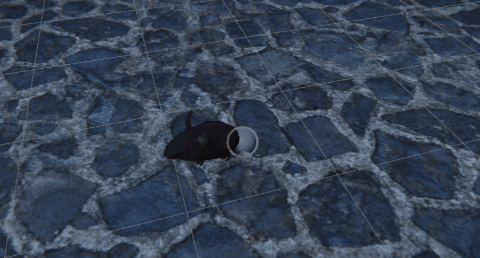

# CrowdEvade

A Unity DOTS project demonstrating dynamic swarm avoidance behavior with 10,000 agents.

---

## Overview

**CrowdEvade** is a small learning project built with Unity DOTS, showcasing basic ECS-driven swarm avoidance mechanics.  
The goal is to experiment with Unity's **ECS (Entity Component System)**, **Job System**, and **Burst Compiler** in a simple but meaningful scenario.

This project is ideal for developers who have a basic understanding of DOTS and are looking for a clear example of combining **ECS** with **MonoBehaviour** in a hybrid workflow.

---

## About This Project

This project was inspired by the swarm mechanics seen in *A Plague Tale* games, focusing on creating a lightweight, high-performance version using Unity DOTS.  
It simulates large numbers of rats dynamically surrounding a player, showcasing swarm behavior and avoidance logic in a DOTS-friendly way.

---

## Features

- ✅ Hybrid character controller (Entity + GameObject)
- ✅ Swarm behavior with 10,000 agents
- ✅ Dynamic avoidance around a moving player
- ✅ Efficient multithreaded performance using Jobs and Burst (including Parallel Jobs)
- ✅ Clear separation of MonoBehaviour input and ECS logic

---

## How It Works

### Player

- Implemented with a **hybrid model** (both GameObject and Entity).
- The GameObject handles:
  - Player **input** (via MonoBehaviour)
  - **Animation** updates
  - **Position synchronization** with the Entity in the ECS world

### Rats (Agents) and Wander Targets

- Each **Wander Target** is an Entity that maintains a desired distance from the player.
  - If the player gets too close, the Wander Target **moves away**.
  - When the player moves far enough, the Wander Target **returns** to its original position while it keeps its distance from the player.

- Each **Agent (Rat)**:
  - Follows its assigned Wander Target.
  - **Wanders** around the target by periodically selecting random positions nearby.
  - **Does not** directly respond to the player — only to its Wander Target.

A visual example:
- The **sphere** represents a Wander Target.
- The **rat** (agent) moves around the target, choosing new random positions over time.

---

## Getting Started

> Requirements:
> - Unity 6.0 or newer (with Entities 1.3.14 package installed)
> - Basic familiarity with Unity DOTS (Entities, Jobs, Burst)

Clone the repository and open it in Unity.  
The main scene is ready to run — simply press **Play** to see the system in action!
You can modify the agent behavior settings under the **WanderingConfigAuthoring** component, located on the **AgentsSpawner** GameObject in the subscene.

---

## License

### Code

The code in this repository is shared for educational purposes.  
You are free to use, modify, and distribute the code for non-commercial or personal projects.

### Assets

This project includes third-party assets under their respective licenses:

- **Character model and animations**: From [Mixamo](https://www.mixamo.com/) — free to use with an Adobe account, subject to Mixamo licensing.
- **Torch model and VFX**: From [Campfires & Torches Models and FX](https://assetstore.unity.com/packages/3d/environments/campfires-torches-models-and-fx-242552) — free on Unity Asset Store.
- **Rat model**:  
  Mouse by Poly by Google [CC-BY 3.0 License](https://creativecommons.org/licenses/by/3.0/), via [Poly Pizza](https://poly.pizza/m/5N7L6S3uIzx).

> ⚠️ **Important:**  
> Third-party assets are subject to their own licenses and terms of use.  
> Please review each asset’s license if you plan to use it in your own projects, especially for commercial purposes.

---
